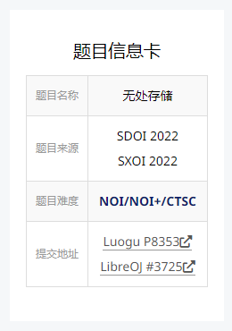
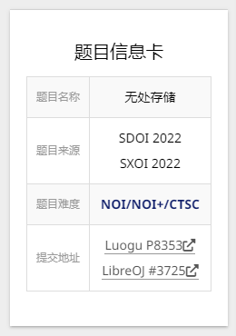

# 题目信息卡

自己对 Hexo 的 NexT 主题的一发魔改。

目前只适用于 Pisces 和 Gemini 两个方案(Scheme)。

设想来源是宝硕对于他[博客](https://oi.baoshuo.ren/)的一些小修改，然后就自己在边改边问宝硕的情况下写出来了。

# 用法

0. 找到你的 NexT 主题文件夹。

1. 打开其下的 `layout\_macro\sidebar.njk`，在其``前加入这里`problem-card.njk`的所有内容。之后找到`<aside class="sidebar">`，将其修改为`<aside class="sidebar" id="sidebar">`。

2. 返回 NexT 主题文件夹，打开其下的 `layout\_partials\footer.njk`，在其最后加入`<script></script>`包裹下的`get-info.js`所有内容。就像下面这样：

``` js
<script>
//get-info.js内的内容
</script>

{{- next_inject('footer') }}
```

3. 返回 NexT 主题文件夹，打开其下的 `source\css\_common\outline\sidebar` 文件夹，将 `problem-card.styl` 拖入其中。然后打开其下的 `index.styl`，在那一堆 `@import` 前面加上一句`@import 'problem-card';`，就像这样：

``` styl
@import 'problem-card';//加入这句
@import 'sidebar-author';
@import 'sidebar-author-links';
//...
```

4. 在你的每一篇文章的Markdown源文件的正文前加上下面的语句：

``` html
<div id="problem-card-vis">true</div>
<div id="problem-info-name">无处存储</div>
<div id="problem-info-from">SDOI 2022<br>SXOI 2022</div>
<div id="problem-info-difficulty">NOI/NOI+/CTSC</div>
<div id="problem-info-color">#0e1d69</div>
<div id="problem-info-submit"><ul><li><a target="_blank" rel="noopener" href="https://www.luogu.com.cn/problem/P8353">Luogu P8353</a></li><li><a target="_blank" rel="noopener" href="https://loj.ac/p/3725">LibreOJ #3725</a></li></ul></div>
```

解释：

1. problem-card-vis

	代表是否有这一个信息卡。

	如果为 `false` 则后面的东西都可以没有。

2. problem-info-name

	题目名称。

	（这个总不能不填吧）

3. problem-info-from

	题目来源。

	没有可以填 `none`。

4. problem-info-difficulty

	题目难度。

	没有可以填 `none`，这样可以不填problem-info-color这一栏。

5. problem-info-color

	如果题目难度有颜色的话可以填颜色。

	支持的颜色格式为一个`#`号后面跟着一个六位十六进制数。

	不符合规则的话就会默认为黑色`#000000`。

6. problem-info-submit

	题目的提交地址。

	（这个总不能也不填吧）
	

上面那一段的最终效果如下：

Pisces:



Gemini:


